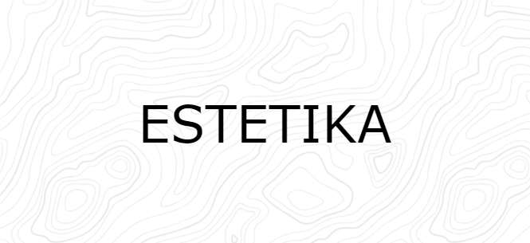

  

## ESTETIKA

ESTETIKA is a cultural exploration platform on a mission to unravel the enchanting world of Indonesian batik. Our vision is to not only promote the beauty of batik but also to contribute to the growth of tourism in regions celebrated for their unique batik heritage. By harnessing cutting-edge technologies, such as AI, our goal is to revolutionize the way we appreciate and engage with this traditional art form.

## Our Purpose

At ESTETIKA, our purpose is to ignite curiosity and encourage the exploration of Indonesian batik. We are dedicated to creating a digital realm where both enthusiasts and inquisitive minds can immerse themselves in the details of this timeless craft. Through the integration of groundbreaking technologies, our goal is to elevate cultural awareness, promote sustainable tourism, and safeguard the profound legacy interwoven into each batik masterpiece.

## Our Offerings

- **Immersive Digital Hub:** Immerse yourself in the enchanting realm of Indonesian batik through our innovative digital hub, where state-of-the-art technologies breathe life into this artistic expression.
- **Engaging Workshops:** Participate in interactive digital workshops that unveil the traditional techniques behind the art of batik, bridging the gap between art enthusiasts and skilled artisans.
- **Dynamic Community Hub:** Become part of our dynamic community hub, a space where you can exchange insights, make discoveries, and share stories about Indonesian batik. Connect with like-minded individuals and contribute to a global cultural exchange.
- **Digital Marketplace:** Explore our e-commerce platform connecting batik enthusiasts with authentic pieces, empowering local artisans, and championing sustainable practices in the batik industry.

## Join Us

If you are passionate about cultural exploration, technology, and contributing to the growth of sustainable tourism, we invite you to join our team at ESTETIKA. Together, let's explore, appreciate, and elevate the rich tapestry of Indonesian batik. For more information, please visit our [website](https://estetika.id) or contact us at [estetikateam2023@gmail.com](mailto:estetikateam2023@gmail.com). We look forward to connecting with you.

## Join Our Journey

If you have a passion for cultural exploration, technology, and a commitment to fostering sustainable tourism, we extend an invitation to join the ESTETIKA team. Let's embark on a collective journey to explore, appreciate, and elevate the intricate world of Indonesian batik. For additional details, please visit our [website](https://estetika.id) or reach out to us at [estetikateam2023@gmail.com](mailto:estetikateam2023@gmail.com). We eagerly anticipate connecting with you.

## Stay Connected with us on social media

<a target="_blank" href="https://www.linkedin.com/in/estetika/"></img></a>
<a target="_blank" href="https://instagram.com/estetika"></img></a>

